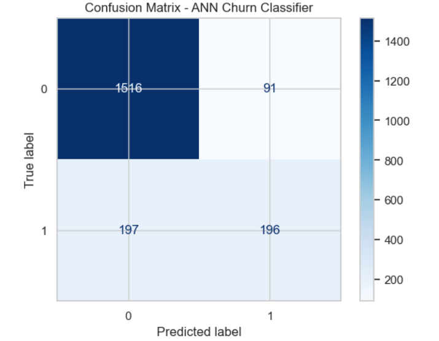

### 🧠 Assignment 2B – Designing a Three-Layered ANN Classifier

This activity builds and evaluates a three-layer Artificial Neural Network (ANN) to predict customer churn using the Churn_Modelling.csv dataset.
The project demonstrates feature preprocessing, network design, training, tuning, and evaluation of a supervised deep-learning model.

**Model Architecture**

- Input Layer (11 features)
- Hidden Layer 1 – 16 neurons, ReLU activation
- Hidden Layer 2 – 8 neurons, ReLU activation
- Output Layer – 1 neuron, Sigmoid activation
- Training Configuration
- Optimizer: Adam
- Loss: Binary Crossentropy
- Epochs: 50 (base) / 75 (tuned)
- Batch Size: 32
- Validation Split: 20 %

**Tools**
Python · NumPy · Pandas · Scikit-learn · TensorFlow / Keras · Matplotlib · Jupyter Notebook

**Evaluation Metrics**
Accuracy · Loss · Confusion Matrix · Validation Performance

**Files**
- 'Jeremiah_Snipes_Assignment2B_ThreeLayer_ANN.ipynb'
- 'assignment_2B_confusion_matrix.png'

**Summary**
The ANN achieved an overall test accuracy of 85.6 %, correctly identifying most customers who stayed while modestly under-detecting churners—typical of class-imbalanced datasets.
Validation accuracy closely matched training accuracy, confirming strong generalization and successful implementation of the assignment requirements.

